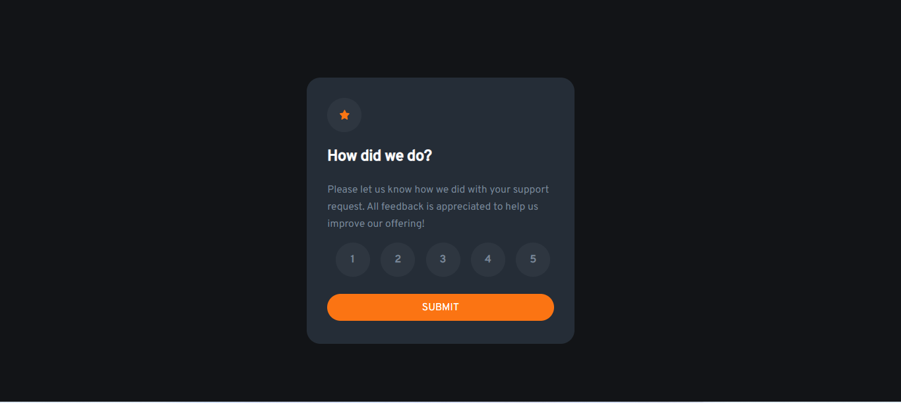
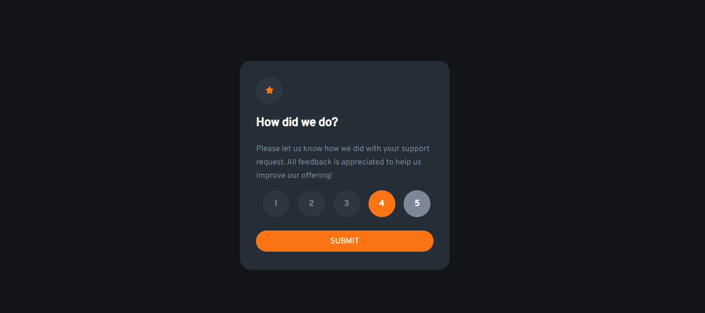
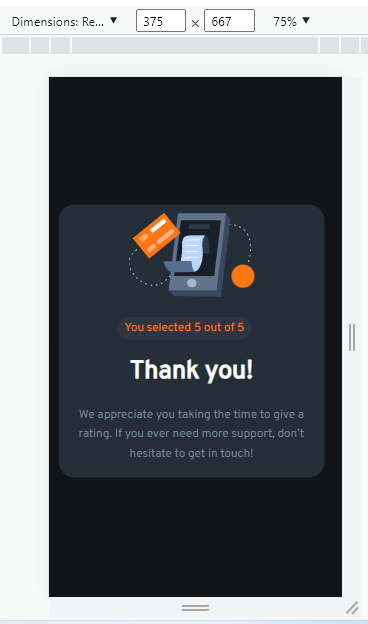

# Frontend Mentor - Interactive rating component solution

This is a solution to the [Interactive rating component challenge on Frontend Mentor](https://www.frontendmentor.io/challenges/interactive-rating-component-koxpeBUmI). Frontend Mentor challenges help you improve your coding skills by building realistic projects. 

## Table of contents

- [Overview](#overview)
  - [Screenshot](#screenshot)
 
- [My process](#my-process)
  - [Built with](#built-with)
- [Author](#author)

## Overview

### Screenshot
#### Desktop-views

#### Mobile-views

## My Process

### Built with

- HTML
- CSS
- JS
- Font Families : -[Overpass](https://fonts.google.com/specimen/Overpass)
## Author

- LinkedIn - [Alaa Ballout](https://www.linkedin.com/in/alaa-ballout/)
- Frontend Mentor - [@alaaballoutdev](https://www.frontendmentor.io/profile/alaaballoutdev)
